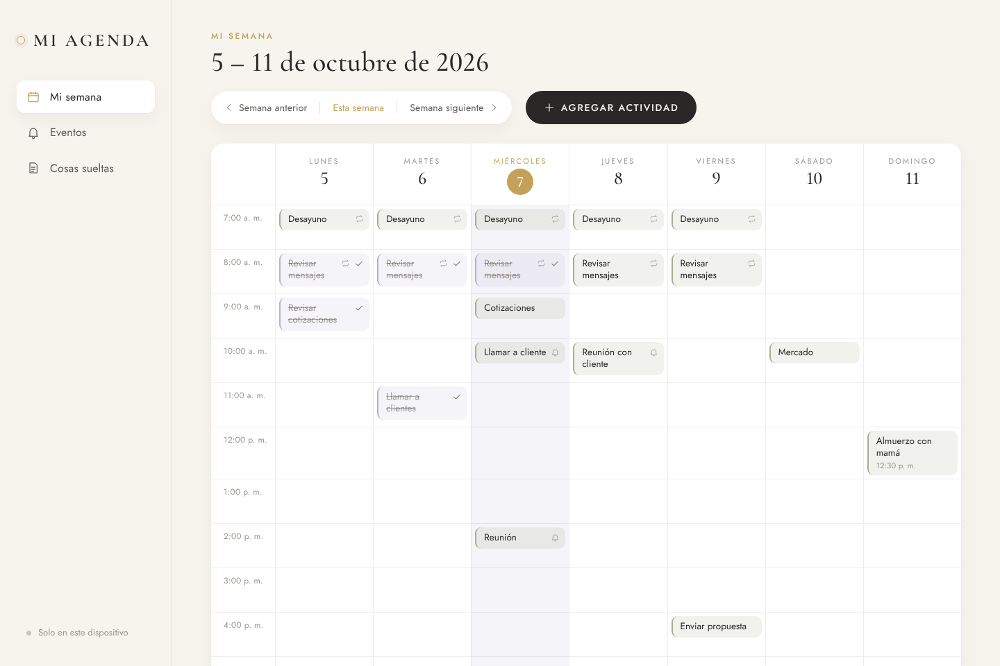
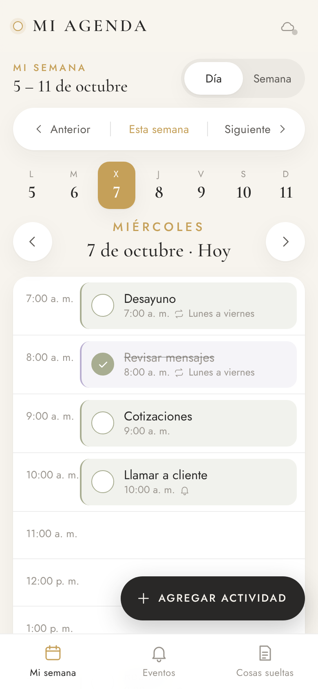
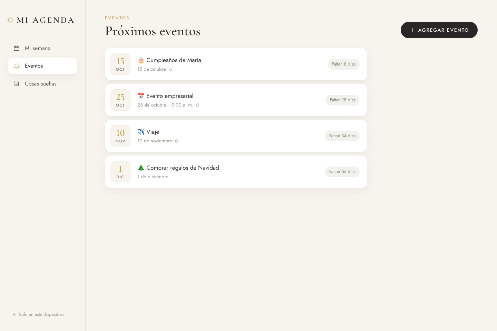
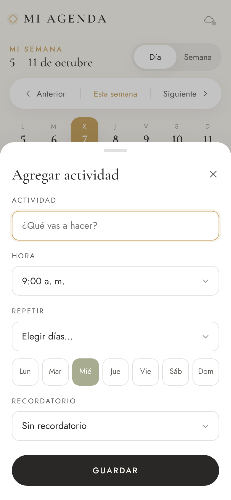

# MI AGENDA

Mi agenda personal: sencilla, elegante y fácil de usar en el celular y en el computador.

Solo hace tres cosas:

| Sección | Para qué sirve |
| --- | --- |
| 🗓 **Mi semana** | Qué voy a hacer y a qué hora, durante toda la semana. |
| 🔔 **Eventos** | Eventos futuros que quiero recordar, con recordatorio. |
| 📝 **Cosas sueltas** | Pendientes y cosas que no quiero olvidar. |

> ¿Tiene una hora? → **Mi semana** · ¿Ocurrirá en el futuro? → **Eventos** · ¿Está pendiente pero todavía no sé cuándo? → **Cosas sueltas**

| Computador | Celular |
| --- | --- |
|  |  |
|  |  |

---

## Cómo se usa

### Mi semana
- Es la pantalla que aparece al abrir la app.
- **Toca una hora** para agregar una actividad en ese día y esa hora, o usa **+ Agregar actividad**.
- El formulario solo pide: actividad, día, hora, repetir y recordatorio.
- **Repetir:** *No repetir*, *Todos los días*, *Lunes a viernes* o *Elegir días…* (marcas L, M, X, J, V, S, D).
  La actividad aparece sola todas las semanas; no hay que copiarla.
- **Toca una actividad** para editarla, cambiar el día, la hora, la repetición o el recordatorio, **marcarla como realizada** o **eliminarla**.
  En una actividad que se repite, "realizada" se marca solo para ese día.
- **Arrastrar:** en el computador, arrastra una actividad a otra hora u otro día. En el celular, mantenla presionada un momento y arrástrala.
- Arriba: **‹ Semana anterior | Esta semana | Semana siguiente ›** con las fechas de la semana.
- En el celular: vista **Día** (con ‹ › para cambiar de día) y vista **Semana**.

### Eventos
- Nombre, fecha, hora (opcional) y recordatorio: *1 día antes*, *3 días antes*, *1 semana antes*, *Personalizado* o *Sin recordatorio*.
- Se muestran ordenados por fecha con los días que faltan ("Faltan 8 días").

### Cosas sueltas
- Escribe y presiona **Guardar** (o Enter). Marca la casilla cuando esté hecha (✓) o elimínala con la ×.

---

## Publicar la app (para abrirla desde cualquier dispositivo)

La app es un sitio web estático (HTML, CSS y JavaScript, sin compilación). Cualquier hosting gratuito sirve:

- **GitHub Pages:** en el repositorio → *Settings → Pages* → *Deploy from a branch* → rama `main`, carpeta `/ (root)`.
  Quedará en `https://<tu-usuario>.github.io/app-agenda/`.
- **Netlify / Vercel / Cloudflare Pages:** conecta el repositorio; no necesita comando de compilación.

Para probarla en tu computador: `npm start` y abre <http://localhost:8080>.

> Las notificaciones y la instalación como app requieren que la página se abra por **https** (todos los servicios anteriores lo usan).

## Instalar en el celular (PWA)

- **iPhone (Safari):** botón *Compartir* → **Agregar a pantalla de inicio**.
- **Android (Chrome):** menú ⋮ → **Instalar app** (o *Agregar a la pantalla principal*).

Se abre a pantalla completa, como una app, y funciona aunque no haya conexión.

## Sincronizar celular y computador

Sin configurar nada, la agenda se guarda en el dispositivo y **no se pierde al cerrar la app**.
Para tener **la misma información en el celular y en el computador**, MI AGENDA usa [Supabase](https://supabase.com) (base de datos e inicio de sesión gratuitos). Configuración, una sola vez (≈ 5 minutos):

1. Crea una cuenta en <https://supabase.com> y un proyecto nuevo (plan gratuito).
2. En el proyecto: **SQL Editor → New query**, pega el contenido de [`supabase/schema.sql`](supabase/schema.sql) y presiona **Run**.
3. (Recomendado) **Authentication → Sign In / Providers → Email**: desactiva *Confirm email* para entrar enseguida al crear la cuenta.
   Si lo dejas activo, al crear la cuenta te llegará un correo para confirmarla.
4. **Project Settings → API**: copia la **Project URL** y la clave pública (**anon public** o **publishable key**).
5. Pégalas en [`js/config.js`](js/config.js):
   ```js
   export const SUPABASE_URL = 'https://xxxxxxxx.supabase.co';
   export const SUPABASE_ANON_KEY = 'tu-clave-publica';
   ```
   (Alternativa sin tocar el código: en la app toca la **nube** / *Solo en este dispositivo* → *Conectar base de datos* y pégalas ahí; hay que hacerlo en cada dispositivo.)
6. En la app toca la **nube** → **Crear cuenta** con tu correo y una contraseña. En los demás dispositivos usa **Iniciar sesión** con el mismo correo.

Lo que ya tenías guardado en cada dispositivo se suma a la cuenta. A partir de ahí, los cambios se sincronizan solos: al guardar, al volver a abrir la app y cada 30 segundos mientras está abierta. Sin conexión puedes seguir usándola; los cambios se envían cuando vuelve la conexión.

La clave pública es segura en el navegador: cada persona solo puede ver y modificar sus propios datos (reglas *Row Level Security* en `schema.sql`).

## Recordatorios

Usan las **notificaciones del navegador**. La primera vez que guardes algo con recordatorio, el navegador pedirá permiso.

- **Computador:** llegan mientras MI AGENDA esté abierta (puede estar en otra pestaña o minimizada).
- **Celular:** llegan mientras la app esté abierta o en segundo plano reciente. En **iPhone** solo funcionan si la app está **instalada en la pantalla de inicio** (iOS 16.4 o superior).
- Si la app estaba cerrada a la hora del aviso de un evento, el aviso aparece al abrirla (siempre que el evento no haya pasado).
- Además de la notificación, el aviso se muestra dentro de la app.

> Límite técnico: una página web no puede despertar el celular cuando está completamente cerrada sin un servidor de notificaciones *push*. Si más adelante se necesita, se puede agregar con una función programada de Supabase y Web Push, sin cambiar el resto de la app.

---

## Para desarrolladores

```
index.html            estructura y navegación (barra lateral / barra inferior)
css/styles.css        diseño (paleta: marfil, blanco, oliva, dorado, carbón, lavanda sutil)
js/app.js             arranque y navegación entre las 3 secciones
js/store.js           datos guardados en el dispositivo (localStorage) + base para sincronizar
js/sync.js            sincronización con Supabase (API REST, sin librerías)
js/agenda.js          lógica de actividades (repetición, realizadas, mover)
js/events.js          lógica de eventos (orden, días que faltan, momento del aviso)
js/reminders.js       recordatorios y notificaciones
js/view-*.js          pantallas: Mi semana, Eventos, Cosas sueltas
js/sync-ui.js         hoja de inicio de sesión / sincronización
sw.js                 service worker (sin conexión + notificaciones)
supabase/schema.sql   tabla, permisos y regla "gana el cambio más reciente"
tests/                prueba completa en navegador (computador, celular, recordatorios y sincronización)
```

**Modelo de datos:** cada elemento (`activities`, `events`, `things`) tiene `id` y `updatedAt`. Los eliminados se guardan como "lápidas" (`deleted: true`) para que la eliminación llegue a todos los dispositivos. En el servidor, todo vive en una tabla `items` con el contenido en JSON.

**Pruebas:**

```bash
npm install
npx playwright install chromium   # solo la primera vez
npm test
```

La prueba abre la app en un computador y en un celular simulados y verifica: crear, editar, mover, marcar como realizada y eliminar actividades; repetición por días específicos, *Lunes a viernes* y *Todos los días*; eventos y días que faltan; recordatorios (con reloj simulado); cosas sueltas; que todo se conserve al recargar; y la sincronización entre tres dispositivos usando un servidor que imita a Supabase.
